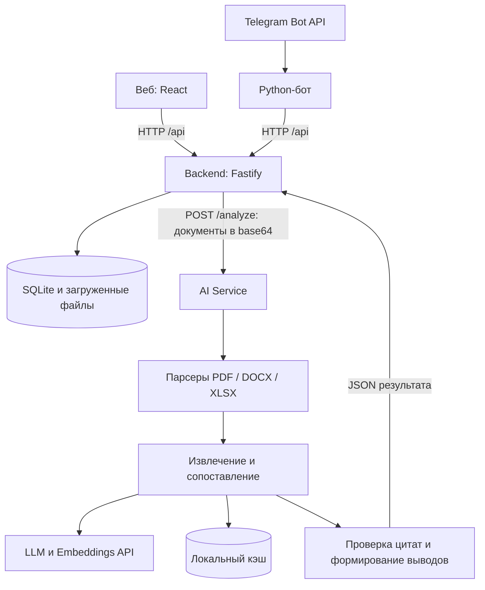

# Reorg AI — анализ организационной структуры и функционала

## Краткое описание

**Что изменилось в обязанностях после реорганизации — и где это написано?**

Reorg AI — прототип ИИ-агента, который сравнивает комплекты организационных документов **до и после реорганизации**, сопоставляет подразделения и функции и показывает потенциальные потери функций, дублирование и пересечения ответственности. Каждый выявленный риск сопровождается объяснением и цитатой из исходного документа.

Решение предназначено для сотрудников, анализирующих организационные изменения: специалистов по организационному развитию, внутреннему аудиту и руководителей подразделений. Оно сокращает ручной поиск соответствий в положениях и инструкциях и помогает проверить, кому после изменений поручена конкретная обязанность.

> Это инструмент предварительного анализа. Отсутствие соответствия в загруженных документах не доказывает фактическую потерю функции. Выводы проверяет ответственный сотрудник.

## Что реализовано

- Загрузка нескольких **PDF, DOCX и XLSX** на каждую сторону сравнения.
- Извлечение подразделений и функций с привязкой к исходным фрагментам.
- Сопоставление подразделений: сохранённые, переименованные, преобразованные, созданные, удалённые и неопределённые соответствия.
- Сопоставление функций по смыслу, действию, объекту и роли: эквивалентность, перенос, частичное совпадение или отсутствие достаточного соответствия.
- Поиск трёх типов рисков: **потеря функции, дублирование функции, пересечение ответственности**.
- Проверка цитат: вывод включается в результат только при совпадении источника и цитаты с извлечённым фрагментом.
- Веб-интерфейс: загрузка, история анализов, сводка, списки подразделений и функций, карточки выводов с доказательствами.
- Telegram-бот как второй интерфейс к тому же backend.
- Фоновый запуск из веба, автоматическое обновление статуса, таймер, сохранение ошибок и повторный запуск без повторной загрузки файлов.
- Локальное хранение результатов и кэш успешных ответов AI-провайдера для ускорения повторов.

## Как работает решение

1. Пользователь создаёт анализ и загружает документы в группы **«До»** и **«После»** — минимум один файл с каждой стороны.
2. Backend сохраняет файлы, создаёт запись анализа и передаёт содержимое AI Service.
3. Парсеры извлекают текст и координаты источников. LLM и правила выделяют подразделения, функции и роли действий.
4. Embeddings используются для поиска смысловых соответствий. Для неоднозначных пар функций сервис обращается к LLM; правила различают, например, исполнение и контроль.
5. Сервис ищет потенциальные потери, дублирование и пересечения ответственности, проверяет цитаты и возвращает структурированный результат.
6. Backend сохраняет результат. Пользователь видит сводку и открывает каждый вывод вместе с доказательствами.

Веб получает HTTP 202 после запуска и опрашивает состояние. Вкладку можно закрыть: обработка продолжится, пока работает backend. Telegram использует синхронный запуск и получает итог через тот же API.

## Технологии

| Компонент | Стек |
| --- | --- |
| Веб-интерфейс | TypeScript, React 19, Vite 8, React Router, TanStack Query, Tailwind CSS 4, Base UI, Lucide |
| Backend | JavaScript, Node.js, Fastify 5, SQLite через `node:sqlite`, multipart, CORS, Swagger/OpenAPI |
| AI Service | JavaScript, Node.js, PDF.js для PDF, Mammoth и Cheerio для DOCX, ExcelJS для XLSX, Zod для валидации |
| AI-модели по умолчанию | `gpt-4o-mini` для извлечения и уточнения соответствий; `text-embedding-3-small` для смысловых векторов |
| Внешние AI API | OpenAI-совместимые `/chat/completions` и `/embeddings`; запросы через встроенный `fetch` |
| Telegram | Python, `python-telegram-bot` 22.8, `httpx`, SQLite для пользовательских сессий |

Модели и адреса API настраиваются переменными окружения. LLM-провайдер должен поддерживать используемый формат `json_schema` structured output. Это заданная последовательность обработки с вызовами моделей, без автономного поиска в интернете и без дообучения моделей.

## Архитектура



```text
frontend/     веб-интерфейс и адаптер ответа API
backend/      API, SQLite, загрузка файлов, управление запуском
ai-service/   парсеры, модели, сопоставление и проверка источников
bot/          Telegram-интерфейс и пользовательские сессии
examples/     before.xlsx и after.xlsx для демонстрации
```

Backend хранит полный ответ AI Service: `summary`, `fragments`, `departments`, `functions`, `department_matches`, `function_matches`, `findings`. Источники содержат ID документа и фрагмента, имя файла, цитату и доступные координаты.

Основные маршруты:

| Метод и путь | Назначение |
| --- | --- |
| `POST /api/analyses` | Создать анализ: `{"name":"Демонстрация"}` |
| `POST /api/analyses/:id/documents` | Загрузить файл: multipart-поля `side=before\|after` и `file` |
| `POST /api/analyses/:id/run?background=true` | Запустить в фоне, ответ HTTP 202 |
| `POST /api/analyses/:id/run` | Запустить с ожиданием результата, используется ботом |
| `GET /api/analyses/:id` | Прочитать статус и ошибку |
| `GET /api/analyses/:id/result` | Получить полный JSON завершённого анализа |
| `GET /api/analyses` | Получить историю анализов |

Интерактивная документация API: [Swagger UI](http://localhost:3000/docs/).

## Установка и запуск

### Требования

- **Node.js 24+** и npm.
- **Python 3.10+** — только для Telegram-бота.
- Доступ к AI API и ключ с доступом к LLM и embeddings — для реального анализа.
- Три терминала для AI Service, backend и frontend; четвёртый — при запуске бота.

### Подготовка

```bash
git clone https://github.com/BAITC-Hacks/hack-30bde13e-ai-krusty-krab.git
cd hack-30bde13e-ai-krusty-krab
```

Если репозиторий закрыт, для клонирования потребуется доступ к нему. Все следующие блоки начинаются **из корня репозитория в отдельном терминале**. Команды рассчитаны на macOS/Linux. Существующий `.env` не перезаписывается.

### Терминал 1 — AI Service

```bash
cd ai-service
npm ci
cp -n .env.example .env
```

Откройте `ai-service/.env` и задайте значения:

```dotenv
LLM_PROVIDER=openai
LLM_API_KEY=ваш_API_ключ
LLM_MODEL=gpt-4o-mini
EMBEDDING_PROVIDER=openai
EMBEDDING_MODEL=text-embedding-3-small
```

Если используется OpenAI, одного `LLM_API_KEY` достаточно: embeddings используют его при отсутствии отдельного `EMBEDDING_API_KEY`. При другом провайдере задайте `LLM_BASE_URL`, `EMBEDDING_BASE_URL` и подходящие модели. Ключи не нужно добавлять во frontend.

```bash
npm start
```

Проверка: [http://localhost:8001/health](http://localhost:8001/health).

### Терминал 2 — backend

```bash
cd backend
npm ci
cp -n .env.example .env
```

В `backend/.env` установите:

```dotenv
PORT=3000
AI_SERVICE_URL=http://localhost:8001
USE_MOCK_AI=false
CORS_ORIGINS=http://localhost:5173
```

```bash
npm run dev
```

Проверка: [http://localhost:3000/health](http://localhost:3000/health). База и файлы создаются в `backend/data/`.

### Терминал 3 — frontend

```bash
cd frontend
npm ci
npm run dev
```

Откройте **[http://localhost:5173](http://localhost:5173)**. Vite направляет `/api` на backend, работающий на порту 3000. Для обычного локального запуска `VITE_API_URL` задавать не нужно: явно пустое значение включает отдельный демонстрационный режим браузера.

После изменения `.env` перезапустите соответствующий сервис. Если порт занят, завершите прежний экземпляр сервиса или согласованно измените порты и адреса в настройках.

### Telegram-бот — необязательно

Получите токен своего бота через [BotFather](https://t.me/BotFather). Backend и AI Service должны быть запущены.

```bash
cd bot
python3 -m venv .venv
source .venv/bin/activate
pip install -r requirements.txt
export TELEGRAM_BOT_TOKEN='токен_вашего_бота'
export BACKEND_URL='http://127.0.0.1:3000'
python bot.py
```

Бот читает переменные окружения; файл `.env` автоматически не загружается. Используется long polling, публичный сервер и webhook не нужны.

В личном чате с ботом:

1. `/new Проверка реорганизации`.
2. Отправьте файлы «до» как документы.
3. `/after`, затем отправьте файлы «после».
4. `/run` — запуск; `/result` — сводка; `/finding 1` — первый вывод с цитатами.
5. `/list` — ваши анализы, созданные через бота.

### Демонстрация без AI-ключа

Запустите только backend и frontend, оставив в `backend/.env` **`USE_MOCK_AI=true`**. Можно проверить загрузку и сохранение данных, навигацию и получение результата. Содержимое документов не анализируется, выводов не будет; интерфейс показывает предупреждение о демонстрационном режиме.

## Как проверить решение

### Сценарий на примерах из репозитория

1. Запустите все три сервиса с **`USE_MOCK_AI=false`**.
2. На главной нажмите **«Начать анализ»**.
3. Загрузите [`examples/before.xlsx`](examples/before.xlsx) в «До», [`examples/after.xlsx`](examples/after.xlsx) — в «После».
4. Нажмите **«Запустить анализ»**. Страница покажет состояние обработки, затем результат.
5. Изучите «Обзор», «Подразделения», «Функции» и «Выводы». Откройте карточку вывода и сравните цитату с исходной строкой Excel.

В файлах специально заложены следующие ситуации:

| Что проверять | Данные примера |
| --- | --- |
| Изменение распределения функций | Обработка заявок на закупки была у отдела закупок; после изменений указана у отдела снабжения и отдела логистики. |
| Потенциальная потеря | Ведение реестра договоров аренды есть «до» и отсутствует в комплекте «после». |
| Потенциальное дублирование | Два подразделения «после» обрабатывают заявки на закупки. |
| Пересечение ответственности | Отдел контроля контролирует обработку тех же заявок. Требуется экспертная оценка разграничения ролей. |

Это контрольные ситуации для проверки, а не обещание фиксированного числа выводов: ответы моделей и пороги могут влиять на результат. Для изучения всех пар соответствий откройте `GET /api/analyses/:id/result` и поле `function_matches`.

### Автоматические проверки — необязательно

Из корня, после установки зависимостей:

```bash
npm test --prefix ai-service
npm test --prefix backend
npm run build --prefix frontend
npm run lint --prefix frontend
```

Для бота, в его виртуальном окружении:

```bash
cd bot
python -m unittest test_bot.py
```

Проверки AI Service используют подставные ответы и не расходуют токены. Они проверяют парсинг, риски, привязку цитат, ошибки провайдера и кэш. Backend проверяет загрузку, передачу файлов, сохранение результата, ошибки и фоновый запуск. Эти проверки не заменяют оценку точности модели на размеченном корпусе.

## Данные и интеграции

**Входные данные:** загруженные пользователем положения о подразделениях, должностные инструкции, организационные и распорядительные документы, приложения и внутренние нормативные документы. Поддерживаются `.pdf`, `.docx`, `.xlsx`; старые бинарные `.doc` и `.xls` не поддерживаются.

**Внешние сервисы:** настроенный LLM/embeddings API и, при использовании бота, Telegram Bot API. Текстовые фрагменты и функции передаются AI-провайдеру; при загрузке через Telegram файлы также проходят через Telegram. Проверка источников работает по загруженному комплекту, без внешнего веб-поиска или автоматического обращения к нормативным базам.

**Локальное хранение:**

- `backend/data/app.sqlite` — анализы и результаты;
- `backend/data/uploads/` — исходные файлы;
- `bot/data/bot.sqlite` — сессии и принадлежность анализов пользователям бота;
- `ai-service/data/provider-cache/` — успешные ответы моделей и embeddings, содержащие производные данные документов.

Данные, кэш и `.env` исключены из Git. Кэш учитывает модель, endpoint, учётные данные и содержимое запроса. Для его отключения задайте `PROVIDER_CACHE_DIR=` в окружении AI Service; для очистки удалите соответствующий каталог. Удаление анализа само по себе не очищает кэш провайдера.

## Ограничения текущей версии

- **Качество извлечения:** зависит от структуры документа и модели. Метрики precision/recall на размеченном наборе не измерены; оценка уверенности не является статистически откалиброванной вероятностью.
- **Документы:** PDF должен содержать текстовый слой; OCR для сканов отсутствует. DOCX не даёт надёжных номеров страниц, поэтому используются абзацы/разделы. Графические оргсхемы отдельно не распознаются.
- **Размер:** до 20 МБ на файл через backend; AI Service ограничивает совокупный JSON-запрос 100 МБ, включая base64. Большие комплекты требуют разбиения.
- **Модель организации:** сопоставление подразделений преимущественно один к одному; полноценного дерева подчинённости и явной модели слияний/разделений нет.
- **Полнота выводов:** отсутствие функции устанавливается только относительно загруженного комплекта. При пустом наборе функций «после» выводы о потерях подавляются.
- **Представление:** есть сводка и карточки; нет отдельной веб-таблицы пар функций, единого экспортируемого заключения и конкретных рекомендаций по перераспределению.
- **Доступ и эксплуатация:** backend без авторизации, предназначен для локального прототипа. Разделение пользователей в боте не защищает прямой доступ к backend. Для публичного использования нужны авторизация, защита документов и настройка сети.
- **Масштабирование:** один процесс backend на SQLite-базу; нет внешней очереди задач, автоматического продолжения после перезапуска и общего ограничения нагрузки между анализами.
- **Дополнительный анализ:** проверка по законодательству/стандартам и бенчмаркинг других операторов отсутствуют.


## Развёрнутая версия и ссылки

**Публичная deployed-версия не указана в репозитории.** Проверяемый вариант — локальный запуск по инструкции выше. `localhost` доступен только на компьютере, где запущены сервисы.

- [Локальный веб-интерфейс](http://localhost:5173)
- [Локальная документация API](http://localhost:3000/docs/)
- [Репозиторий](https://github.com/BAITC-Hacks/hack-30bde13e-ai-krusty-krab)
- Подробности компонентов: [backend](backend/README.md), [AI Service](ai-service/README.md), [frontend](frontend/README.md), [Telegram-бот](bot/README.md).

Для будущей публикации frontend собирается командой `npm run build` в `frontend/`. Vite proxy действует только при разработке: опубликованному интерфейсу нужен настроенный reverse proxy для `/api` либо `VITE_API_URL` с адресом backend, включая `/api`, и соответствующий `CORS_ORIGINS`. Готового production-развёртывания в проекте нет.
